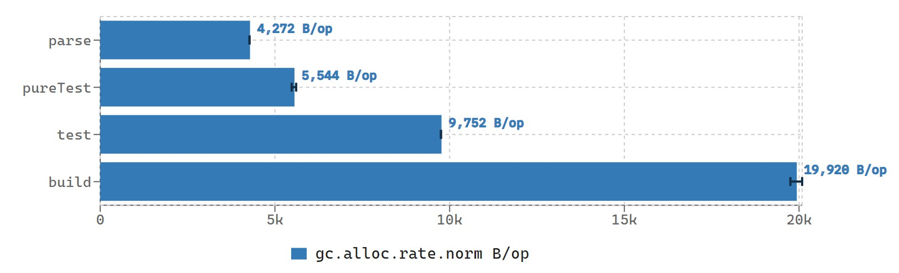

# sirius   

   

:construction: (WIP) Type-safe, lightweight JSON validator with Kotlin DSL.

> Still work in progress, star & watch for further information information? :-)

### TODO

**Now comes the bigger problems should be addressed first...**
 - [ ] Unit test
 - [X] Refactor: exceptions and trace
 - [ ] Refactor: architecture, lazify the build procedure

---

 - [X] Fundamental architecture
 - [X] Global scope or option
   - [X] `required`
   - [X] `any { }`
 - [ ] Validation DSL
   - [X] Number
   - [X] Boolean
   - [X] String
   - [X] JSON Object
   - [ ] JSON Array
   - [X] `null`
 - [X] Documentation for API with [Dokka](https://github.com/Kotlin/dokka)
 - [X] Validation configuration
 - [ ] Unit test
 - [X] Continuous Integration (CI)
 - [ ] (?) SemVer & SemRelease

## Performance

The two graphs posted below is showing the JMH test result on CircleCI, with 2 CPU cores and 4 GB memory. Each test is warmed-up 4 seconds, repeated twice, and then formally tested 8 seconds, repeated twice. The whole procedure will be repeated twice as well.

Two-part of Sirius, build a schema (`build`), and the validation of a given JSON string (`test`), are tested using JMH with the procedure described above. Note that the `test` part naturally involved the parsing of the given JSON string (`parse`), so the pure test procedure in which the parsing is not included is measured by `pureTest`.

The first graph is about throughput, which shows the number of times that the operation can be done in one millisecond. And the second graph is about the norm of allocation rate (AR), which shows how many bytes will be allocated during one execution. *Note that under some measurements the parsing of JSON string using `org.json` also counted as well.*

Related code are in `/src/test/kotlin/.../jmh` folder.

## Acknowledgement

> *Buy me a coffee...?*
> 
> 

This project is developed with IntelliJ IDEA Ultimate and the subscription is obtained freely from [Jetbrains Open Source Support Program](https://www.jetbrains.com/community/opensource/). Thanks to Jetbrains!

